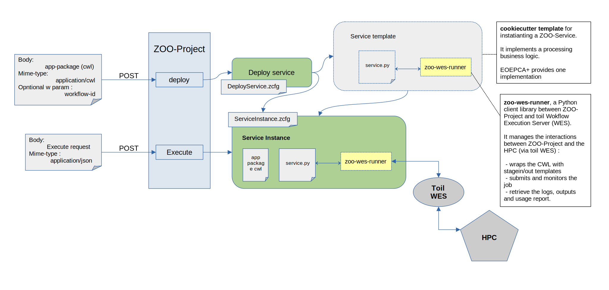

# Introduction

`ZOO WES Runner` provides a client library to connect the [ZOO Project](http://www.zoo-project.org/) to an HPC using [toil Workflow Execution Service (WES)](https://github.com/Duke-GCB/calrissian).

The goal is to ease the development of runners that implement a business logic for the EOEPCA ADES ZOO-Project implementation.

A runner provides an execution engine for ZOO-Project. This repository and documentation provides a runner for toil WES.

Below an overview of the building block



## Service deployment

When a service is deployed, the ADES instantiates a cookiecutter processing service template.

The scaffolded service folder contains a `service.py` Python file that executes the Application Package.

The `service.py` must implement a function with the signature:

```
def {{cookiecutter.workflow_id | replace("-", "_")  }}(conf, inputs, outputs):
```

And return `zoo.SERVICE_SUCCEEDED` if the execution is a success or `zoo.SERVICE_FAILED` if failed.

It must also implement an `ExecutionHandler`.

The `ExecutionHandler` is a abstract class defined as follows:


```python
from abc import ABC, abstractmethod


class ExecutionHandler(ABC):
    def __init__(self, **kwargs):
        self.__dict__.update(kwargs)
        self.job_id = None

    def set_job_id(self, job_id):
        self.job_id = job_id

    @abstractmethod
    def pre_execution_hook(self):
        pass

    @abstractmethod
    def post_execution_hook(self):
        pass

    @abstractmethod
    def get_secrets(self):
        pass

    @abstractmethod
    def get_pod_env_vars(self):
        pass

    @abstractmethod
    def get_pod_node_selector(self):
        pass

    @abstractmethod
    def handle_outputs(self, execution_log, output, usage_report, tool_logs=None):
        pass

    @abstractmethod
    def get_additional_parameters(self):
        pass
```

## Service execution

The service execution follows the `ZooWESRunner` execution defined in its `execute` method.

## What EOEPCA provides

EOEPCA provides:

* a example of a ZOO-Service template in the [https://github.com/EOEPCA/eoepca-proc-service-template-wes](https://github.com/EOEPCA/eoepca-proc-service-template-wes) software repository

Other service template can of course be implemented with different business logics and interfacing with other systems or APIs.
